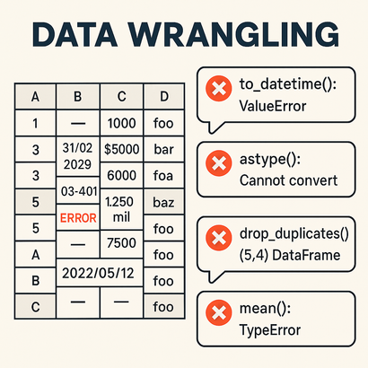

# Data Wrangling & Cleaning Data

> _"Most of the time, a Data Scientist is not building models — they're preparing data."_

---

## Purpose

This project aims to **emphasize the importance of data cleaning**, which is one of the most time-consuming and critical tasks in any data science pipeline.

In real-world scenarios, datasets often come with a wide range of issues: missing values, inconsistent formats, invalid entries, duplicates, and more. Therefore, being able to **handle dirty data** and deliver **clean, reliable datasets** is a key skill for any Data Scientist.

---

## What this repository contains

- Gradual collection of **reusable utilities** that I use in real-world public projects
- Functions for **cleaning strings, parsing dates, validating emails, normalizing salaries**, etc.
- Implementations using **Pandas**, **PySpark**, and **R **
- **Public and simulated datasets** with realistic challenges

---

## Goals

- Reuse and improve data cleaning utilities over time
- Demonstrate my ability to **deal with messy, unstructured, or inconsistent data**
- Provide **ready-to-analyze datasets** for further exploration, insight extraction, and modeling
- Keep this project as an **ongoing and evolving portfolio**, always adding new cases and tools

---

## Notes

- All datasets used here are **PUBLICLY AVAILABLE** or **SIMULATED** to mimic real-world dirty data.

---

## 👤 Author

**Thiago Guimarães**

* 🌐[LinkedIn](https://www.linkedin.com/in/thiagodatascientist/)
* 📧 Email: [thiago.guimaraes.sto@gmail.com](mailto:thiago.guimaraes.sto@gmail.com)
* 📱 WhatsApp: [+55 48 99673-7618](https://wa.me/5548996737618)